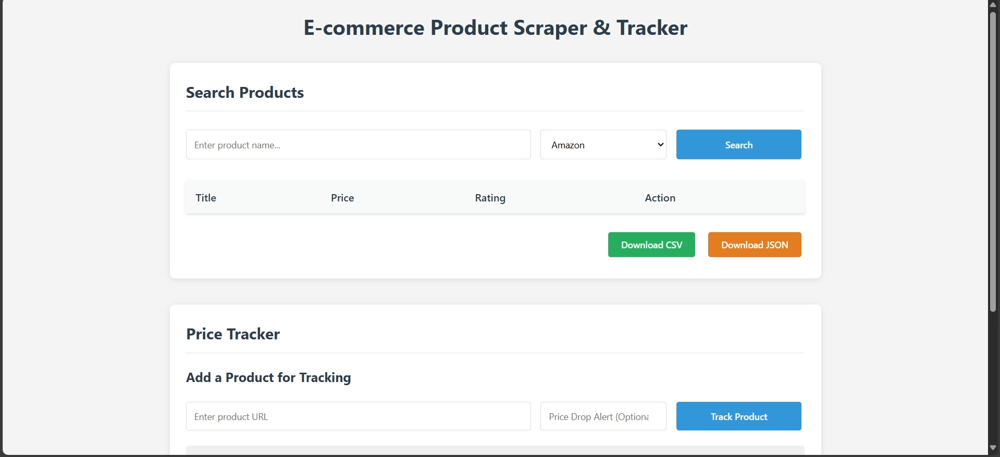
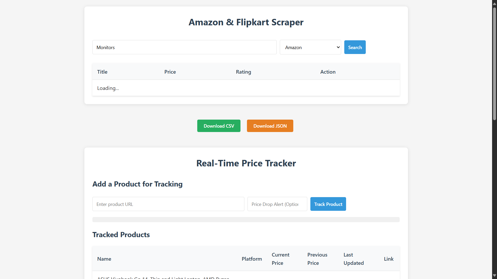
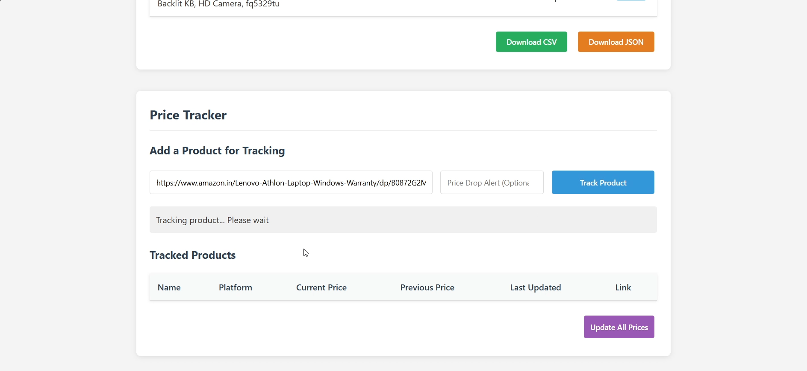
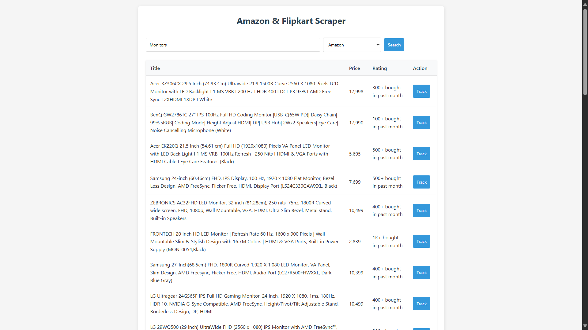

# 🛒 Smart E-Commerce Web Scraper

## 📌 Overview

The **Smart E-Commerce Web Scraper** is an advanced tool designed to extract structured product data from e-commerce platforms efficiently. By providing a search results URL (e.g., Amazon), the scraper retrieves key product details, such as **titles, prices, ratings, and availability**, which can be exported in **CSV or JSON formats** for further analysis. This tool is particularly useful for **competitive analysis, price tracking, market research, and data-driven decision-making**. It helps businesses and consumers monitor price fluctuations, compare products, and gather essential insights for smarter purchasing decisions.

## ✨ Key Features

- 🔍 **Automated Data Extraction**: Retrieves essential product information, including titles, prices, ratings, and availability in real time.
- 📥 **Multiple Export Formats**: Supports data export in **CSV and JSON formats**, making it easy to store and analyze data.
- ⚡ **Product Tracking Integration**: A **Track button** enables users to monitor product changes over time and stay updated on pricing trends.
- 🎨 **Enhanced User Experience**: Implements **loading animations** and a streamlined UI for improved responsiveness and usability.
- ✅ **Robust Technology Stack**: Built using **Flask (Python), Selenium, BeautifulSoup, HTML, CSS, and JavaScript**, ensuring a scalable and maintainable architecture.
- 🌐 **Cross-Browser Compatibility**: Designed to work across multiple browsers for a seamless user experience.
- 🏷 **Advanced Filtering Options**: Allows users to apply filters for specific price ranges, ratings, and product categories to refine search results.

## 🏗️ Technology Stack

- **Backend:** Flask (Python), Selenium, BeautifulSoup
- **Frontend:** HTML, CSS, JavaScript
- **Database (Optional for Tracking Features):** SQLite / MongoDB (Planned for Future Development)
- **Web Scraping Tools:** Selenium for browser automation, BeautifulSoup for parsing HTML content

## 🚀 Installation & Setup

### 1️⃣ Clone the Repository

```bash
git clone https://github.com/yourusername/smart-ecommerce-scraper.git
cd smart-ecommerce-scraper
```

### 2️⃣ Install Dependencies

Ensure that **Python 3.8+** is installed on your system.

```bash
pip install -r requirements.txt
```

### 3️⃣ Run the Flask Server

```bash
python app.py
```

By default, the application will be available at `http://127.0.0.1:5000/`.

### 4️⃣ (Optional) Configure WebDriver
Since the scraper uses **Selenium**, ensure you have the appropriate WebDriver installed for your browser. For Chrome users:

```bash
# Download ChromeDriver and place it in the project directory
# Ensure the driver matches your Chrome version
```

## 🎯 How to Use

1️⃣ Open the **web application** in your browser.

2️⃣ Paste an **e-commerce search URL** (e.g., an Amazon search results page) into the input field.

3️⃣ Click **Scrape** to initiate the data extraction process.

4️⃣ View and analyze the extracted data in a structured tabular format.

5️⃣ Download the results in **CSV or JSON format** for offline use or further processing.

6️⃣ (If tracking is enabled) Use the **Track button** to monitor product price fluctuations over time.

7️⃣ Apply **filters** to refine search results based on price range, rating, or specific product attributes.

## 📸 Screenshots

| Home Page | Scraping in Action | Tracking in Action | Extracted Data |
| --------- | ------------------ | ------------------ | -------------- |
|  |  |  | |

## 🔧 Future Enhancements

- 📦 **Support for Additional E-Commerce Platforms**: Extend compatibility to websites like Flipkart, eBay, and Walmart.
- 📊 **Automated Price Tracking & Historical Data Analysis**: Implement price trend analysis for enhanced tracking.
- 📜 **User Authentication for Personalized Data Storage**: Allow users to save searches and access data across multiple sessions.
- 📡 **API Integration for Real-Time Data Retrieval**: Provide an API for developers to integrate scraping functionality into their own applications.
- 🖼 **Product Image Scraping**: Extract and display product images alongside extracted data for better visualization.
- 🔍 **Advanced Search Capabilities**: Implement keyword-based search and sorting functionalities.
- 📈 **Data Visualization**: Add interactive charts to help users analyze price trends over time.

## 🤝 Contributing

Contributions are welcome! If you'd like to improve the scraper, feel free to fork the repository, create a new branch, and submit a pull request. Here’s how you can contribute:

1. Fork the repository and clone it locally.
2. Create a new branch (`git checkout -b feature-branch`).
3. Implement your changes and commit (`git commit -m "Added a new feature"`).
4. Push to GitHub (`git push origin feature-branch`).
5. Submit a pull request for review.

## 💡 Author

Developed by **Krish Patel**. Connect on [LinkedIn](https://www.linkedin.com/in/krish-patel-74532123b/) or explore more projects on [GitHub](https://github.com/Krish-0610).

